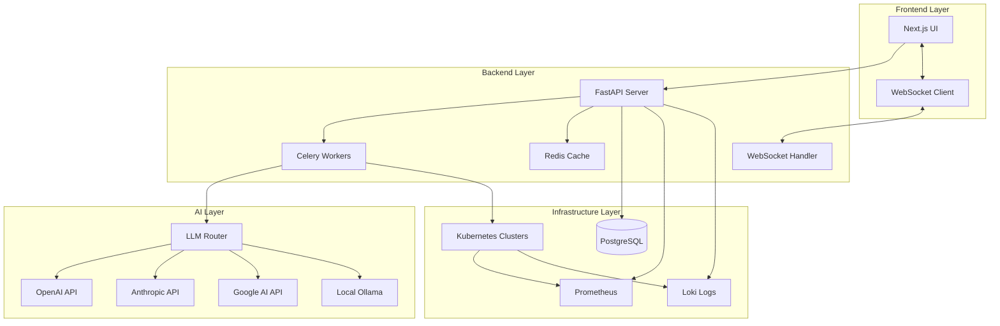

# Design Document: DevOps K8s Platform

## Overview

The DevOps K8s Platform is a full-stack web application that automates the transformation of Docker Compose configurations into production-ready Kubernetes deployments. The system leverages Large Language Models (LLMs) to intelligently convert Docker Compose YAML into Kubernetes manifests while applying best practices, then orchestrates deployment to target clusters with real-time monitoring and AI-powered observability.

The platform consists of three primary layers:
1. **Frontend Layer**: Next.js 14+ application providing the user interface
2. **Backend Layer**: FastAPI server handling business logic, orchestration, and external integrations
3. **Infrastructure Layer**: Kubernetes clusters, monitoring systems, and data stores

The system follows an event-driven architecture with asynchronous task processing for long-running operations, WebSocket connections for real-time updates, and a modular design that supports multiple LLM providers and Kubernetes cluster types.

## Architecture

### High-Level Architecture



### Component Interaction Flow

**Upload and Conversion Flow:**
1. User uploads Docker Compose file through Frontend
2. Frontend sends file to Backend API
3. Backend validates YAML syntax and extracts structure
4. Backend creates Celery task for AI conversion
5. Celery worker sends Docker Compose to LLM via LLM Router
6. LLM generates Kubernetes manifests
7. Backend caches result in Redis
8. Backend returns manifests to Frontend
9. Frontend displays manifests in editor with diff view

**Deployment Flow:**
1. User clicks deploy button in Frontend
2. Frontend establishes WebSocket connection
3. Backend creates Celery task for deployment
4. Celery worker applies manifests to Kubernetes cluster
5. Worker sends progress updates via WebSocket
6. Worker performs post-deployment health checks
7. Worker sends completion status via WebSocket
8. Frontend displays final deployment status

**Monitoring Flow:**
1. Frontend requests metrics from Backend API
2. Backend queries Prometheus for pod/service metrics
3. Backend queries Loki for log streams
4. Backend returns aggregated data to Frontend
5. Frontend displays real-time charts and logs
6. User requests AI log analysis
7. Backend sends logs to LLM via LLM Router
8. LLM returns analysis with anomalies and recommendations
9. Frontend displays analysis summary

## Components and Interfaces

### Frontend Components

#### 1. Upload Component
**Responsibility:** Handle file upload and display parsed structure

**Interface:**
```typescript
interface UploadComponentProps {
  onUploadComplete: (fileId: string, structure: ComposeStructure) => void;
  onError: (error: string) => void;
}

interface ComposeStructure {
  services: ServiceDefinition[];
  volumes: VolumeDefinition[];
  networks: NetworkDefinition[];
}

interface ServiceDefinition {
  name: string;
  image: string;
  ports: PortMapping[];
  environment: Record<string, string>;
  volumes: string[];
  dependsOn: string[];
}
```

**Key Operations:**
- `handleFileDrop(file: File): Promise<void>` - Process dropped file
- `validateFile(file: File): boolean` - Check file type and size
- `uploadFile(file: File): Promise<ComposeStructure>` - Send to backend

#### 2. Manifest Editor Component
**Responsibility:** Display and edit generated Kubernetes manifests

**Interface:**
```typescript
interface ManifestEditorProps {
  manifests: KubernetesManifest[];
  originalCompose: string;
  onManifestChange: (manifests: KubernetesManifest[]) => void;
}

interface KubernetesManifest {
  kind: string;
  name: string;
  content: string;
  namespace: string;
}
```

**Key Operations:**
- `renderDiff(): ReactNode` - Show compose vs manifest comparison
- `validateYAML(content: string): ValidationResult` - Real-time syntax check
- `exportManifests(): void` - Download as ZIP

#### 3. Deployment Dashboard Component
**Responsibility:** Display real-time deployment progress

**Interface:**
```typescript
interface DeploymentDashboardProps {
  deploymentId: string;
  onComplete: (status: DeploymentStatus) => void;
}

interface DeploymentStatus {
  status: 'pending' | 'in_progress' | 'completed' | 'failed' | 'rolled_back';
  progress: number;
  currentStep: string;
  appliedManifests: string[];
  errors: DeploymentError[];
}
```

**Key Operations:**
- `connectWebSocket(): void` - Establish real-time connection
- `updateProgress(update: ProgressUpdate): void` - Handle progress events
- `handleRollback(): void` - Display rollback information

#### 4. Monitoring Dashboard Component
**Responsibility:** Display metrics, logs, and AI analysis

**Interface:**
```typescript
interface MonitoringDashboardProps {
  deploymentId: string;
  clusterId: string;
}

interface MetricsData {
  pods: PodMetrics[];
  services: ServiceMetrics[];
  timestamp: Date;
}

interface PodMetrics {
  name: string;
  namespace: string;
  cpu: number;
  memory: number;
  network: NetworkMetrics;
}
```

**Key Operations:**
- `fetchMetrics(timeRange: TimeRange): Promise<MetricsData>` - Get metrics
- `streamLogs(filters: LogFilters): AsyncIterator<LogEntry>` - Stream logs
- `requestAIAnalysis(): Promise<AnalysisResult>` - Trigger log analysis

#### 5. Configuration Component
**Responsibility:** Manage AI model and cluster settings

**Interface:**
```typescript
interface ConfigurationProps {
  onSave: (config: PlatformConfig) => void;
}

interface PlatformConfig {
  llmProviders: LLMProviderConfig[];
  selectedModel: string;
  modelParameters: ModelParameters;
  clusters: ClusterConfig[];
}

interface LLMProviderConfig {
  provider: 'openai' | 'anthropic' | 'google' | 'ollama';
  apiKey: string;
  endpoint?: string;
}
```

### Backend Components

#### 1. Parser Service
**Responsibility:** Validate and extract Docker Compose structure

**Interface:**
```python
class ParserService:
    def validate_yaml(self, content: str) -> ValidationResult:
        """Validate YAML syntax and return errors if any."""
        pass
    
    def parse_compose(self, content: str) -> ComposeStructure:
        """Extract services, volumes, networks, and dependencies."""
        pass
    
    def extract_services(self, compose_dict: dict) -> List[ServiceDefinition]:
        """Parse service definitions from compose dictionary."""
        pass
```

**Dependencies:**
- `pyyaml` for YAML parsing
- `pydantic` for validation

#### 2. Converter Service
**Responsibility:** Transform Docker Compose to Kubernetes manifests using LLMs

**Interface:**
```python
class ConverterService:
    def __init__(self, llm_router: LLMRouter, cache: CacheService):
        self.llm_router = llm_router
        self.cache = cache
    
    def convert_to_k8s(
        self, 
        compose: ComposeStructure,
        model: str,
        parameters: ModelParameters
    ) -> List[KubernetesManifest]:
        """Convert Docker Compose to Kubernetes manifests."""
        pass
    
    def generate_deployment(self, service: ServiceDefinition) -> str:
        """Generate Deployment manifest for a service."""
        pass
    
    def generate_service(self, service: ServiceDefinition) -> str:
        """Generate Service manifest for network exposure."""
        pass
    
    def apply_best_practices(self, manifest: str) -> str:
        """Add health checks, resource limits, security contexts."""
        pass
```

**LLM Prompt Strategy:**
- System prompt defines role as Kubernetes expert
- Include examples of well-formed manifests
- Specify required best practices (health checks, resource limits, security contexts)
- Request structured output with clear manifest separation
- Include context about target cluster type if relevant

#### 3. LLM Router
**Responsibility:** Abstract multiple LLM providers with unified interface

**Interface:**
```python
class LLMRouter:
    def __init__(self, providers: Dict[str, LLMProvider]):
        self.providers = providers
    
    def generate(
        self,
        prompt: str,
        model: str,
        parameters: ModelParameters,
        retry_count: int = 3
    ) -> str:
        """Send prompt to specified model with retry logic."""
        pass
    
    def manage_context_window(self, content: str, max_tokens: int) -> str:
        """Truncate or summarize content to fit context window."""
        pass

class LLMProvider(ABC):
    @abstractmethod
    def generate(self, prompt: str, parameters: ModelParameters) -> str:
        pass
    
    @abstractmethod
    def get_max_tokens(self) -> int:
        pass
```

**Supported Providers:**
- `OpenAIProvider` - GPT-4, GPT-3.5
- `AnthropicProvider` - Claude Sonnet, Claude Opus
- `GoogleProvider` - Gemini Pro
- `OllamaProvider` - Local Llama models

#### 4. Deployer Service
**Responsibility:** Apply manifests to Kubernetes clusters

**Interface:**
```python
class DeployerService:
    def __init__(self, k8s_client: KubernetesClient, websocket: WebSocketHandler):
        self.k8s_client = k8s_client
        self.websocket = websocket
    
    def deploy(
        self,
        manifests: List[KubernetesManifest],
        cluster_id: str,
        deployment_id: str
    ) -> DeploymentResult:
        """Apply manifests to cluster with progress tracking."""
        pass
    
    def apply_manifest(self, manifest: KubernetesManifest) -> bool:
        """Apply single manifest using kubectl or K8s API."""
        pass
    
    def rollback(self, deployment_id: str) -> bool:
        """Remove all resources from failed deployment."""
        pass
    
    def health_check(self, namespace: str) -> HealthCheckResult:
        """Verify all pods are running and ready."""
        pass
```

**Deployment Strategy:**
1. Validate cluster connectivity
2. Apply manifests in dependency order (ConfigMaps/Secrets → PVCs → Deployments → Services → Ingress)
3. Send progress update after each manifest
4. Wait 30 seconds after all manifests applied
5. Perform health checks on all pods
6. If any failures, trigger rollback
7. Send final status

#### 5. Monitor Service
**Responsibility:** Collect and aggregate metrics and logs

**Interface:**
```python
class MonitorService:
    def __init__(
        self,
        prometheus_client: PrometheusClient,
        loki_client: LokiClient
    ):
        self.prometheus = prometheus_client
        self.loki = loki_client
    
    def get_pod_metrics(
        self,
        namespace: str,
        time_range: TimeRange
    ) -> List[PodMetrics]:
        """Query Prometheus for pod CPU, memory, network metrics."""
        pass
    
    def stream_logs(
        self,
        namespace: str,
        pod_name: Optional[str] = None,
        filters: Optional[LogFilters] = None
    ) -> AsyncIterator[LogEntry]:
        """Stream logs from Loki with optional filtering."""
        pass
    
    def search_logs(self, query: str, namespace: str) -> List[LogEntry]:
        """Full-text search across logs."""
        pass
```

**Prometheus Queries:**
- CPU: `rate(container_cpu_usage_seconds_total[5m])`
- Memory: `container_memory_usage_bytes`
- Network: `rate(container_network_transmit_bytes_total[5m])`

#### 6. AI Analyzer Service
**Responsibility:** Perform intelligent log analysis

**Interface:**
```python
class AIAnalyzerService:
    def __init__(self, llm_router: LLMRouter):
        self.llm_router = llm_router
    
    def analyze_logs(
        self,
        logs: List[LogEntry],
        model: str
    ) -> AnalysisResult:
        """Detect anomalies and summarize issues."""
        pass
    
    def detect_common_errors(self, logs: List[LogEntry]) -> List[KubernetesError]:
        """Identify OOMKilled, CrashLoopBackOff, ImagePullBackOff."""
        pass
    
    def generate_recommendations(
        self,
        errors: List[KubernetesError]
    ) -> List[str]:
        """Provide actionable recommendations."""
        pass
```

**Analysis Prompt Strategy:**
- Provide log context with timestamps
- Ask LLM to identify patterns and anomalies
- Request severity classification (critical, warning, info)
- Ask for root cause analysis
- Request specific remediation steps

#### 7. Cache Service
**Responsibility:** Cache LLM responses and frequently accessed data

**Interface:**
```python
class CacheService:
    def __init__(self, redis_client: Redis):
        self.redis = redis_client
    
    def get_cached_conversion(self, compose_hash: str) -> Optional[List[KubernetesManifest]]:
        """Retrieve cached manifests if available."""
        pass
    
    def cache_conversion(
        self,
        compose_hash: str,
        manifests: List[KubernetesManifest],
        ttl: int = 86400
    ) -> None:
        """Store manifests with 24-hour TTL."""
        pass
    
    def hash_compose(self, content: str) -> str:
        """Generate SHA-256 hash of compose content."""
        pass
```

#### 8. WebSocket Handler
**Responsibility:** Manage real-time bidirectional communication

**Interface:**
```python
class WebSocketHandler:
    def __init__(self):
        self.connections: Dict[str, WebSocket] = {}
    
    async def connect(self, deployment_id: str, websocket: WebSocket) -> None:
        """Register new WebSocket connection."""
        pass
    
    async def send_progress(
        self,
        deployment_id: str,
        update: ProgressUpdate
    ) -> None:
        """Broadcast progress update to connected clients."""
        pass
    
    async def disconnect(self, deployment_id: str) -> None:
        """Clean up connection."""
        pass
```

#### 9. Alert Service
**Responsibility:** Monitor conditions and trigger notifications

**Interface:**
```python
class AlertService:
    def __init__(self, monitor: MonitorService):
        self.monitor = monitor
        self.alert_configs: Dict[str, AlertConfig] = {}
    
    def register_alert(self, config: AlertConfig) -> str:
        """Register new alert configuration."""
        pass
    
    def check_conditions(self, deployment_id: str) -> List[TriggeredAlert]:
        """Evaluate all alert conditions for deployment."""
        pass
    
    def send_notification(self, alert: TriggeredAlert) -> None:
        """Send notification via configured channel."""
        pass
```

## Data Models

### Database Schema (PostgreSQL)

#### Deployments Table
```sql
CREATE TABLE deployments (
    id UUID PRIMARY KEY DEFAULT gen_random_uuid(),
    user_id UUID NOT NULL,
    name VARCHAR(255) NOT NULL,
    cluster_id UUID NOT NULL,
    compose_content TEXT NOT NULL,
    manifests JSONB NOT NULL,
    status VARCHAR(50) NOT NULL,
    created_at TIMESTAMP DEFAULT NOW(),
    updated_at TIMESTAMP DEFAULT NOW(),
    deployed_at TIMESTAMP,
    error_message TEXT,
    FOREIGN KEY (cluster_id) REFERENCES clusters(id)
);

CREATE INDEX idx_deployments_user_id ON deployments(user_id);
CREATE INDEX idx_deployments_status ON deployments(status);
```

#### Clusters Table
```sql
CREATE TABLE clusters (
    id UUID PRIMARY KEY DEFAULT gen_random_uuid(),
    user_id UUID NOT NULL,
    name VARCHAR(255) NOT NULL,
    type VARCHAR(50) NOT NULL, -- 'minikube', 'kind', 'gke', 'eks', 'aks'
    config JSONB NOT NULL, -- kubeconfig or connection details
    is_active BOOLEAN DEFAULT true,
    created_at TIMESTAMP DEFAULT NOW(),
    updated_at TIMESTAMP DEFAULT NOW()
);

CREATE INDEX idx_clusters_user_id ON clusters(user_id);
```

#### LLM Configurations Table
```sql
CREATE TABLE llm_configurations (
    id UUID PRIMARY KEY DEFAULT gen_random_uuid(),
    user_id UUID NOT NULL,
    provider VARCHAR(50) NOT NULL, -- 'openai', 'anthropic', 'google', 'ollama'
    api_key_encrypted BYTEA NOT NULL,
    endpoint VARCHAR(255),
    is_active BOOLEAN DEFAULT true,
    created_at TIMESTAMP DEFAULT NOW(),
    updated_at TIMESTAMP DEFAULT NOW()
);

CREATE INDEX idx_llm_configs_user_id ON llm_configurations(user_id);
```

#### Alert Configurations Table
```sql
CREATE TABLE alert_configurations (
    id UUID PRIMARY KEY DEFAULT gen_random_uuid(),
    user_id UUID NOT NULL,
    deployment_id UUID,
    condition_type VARCHAR(50) NOT NULL, -- 'cpu_threshold', 'memory_threshold', etc.
    threshold_value FLOAT,
    notification_channel VARCHAR(50) NOT NULL, -- 'email', 'webhook', 'in_app'
    notification_config JSONB NOT NULL,
    is_active BOOLEAN DEFAULT true,
    created_at TIMESTAMP DEFAULT NOW(),
    FOREIGN KEY (deployment_id) REFERENCES deployments(id)
);

CREATE INDEX idx_alerts_deployment_id ON alert_configurations(deployment_id);
```

#### Templates Table
```sql
CREATE TABLE templates (
    id UUID PRIMARY KEY DEFAULT gen_random_uuid(),
    name VARCHAR(255) NOT NULL,
    description TEXT,
    category VARCHAR(100), -- 'web', 'database', 'cache', etc.
    compose_content TEXT NOT NULL,
    required_params JSONB, -- Parameters user must provide
    is_public BOOLEAN DEFAULT true,
    created_at TIMESTAMP DEFAULT NOW()
);

CREATE INDEX idx_templates_category ON templates(category);
```

### Pydantic Models

#### Request/Response Models
```python
from pydantic import BaseModel, Field
from typing import List, Optional, Dict
from datetime import datetime
from enum import Enum

class ComposeUploadRequest(BaseModel):
    content: str = Field(..., description="Docker Compose YAML content")

class ComposeStructure(BaseModel):
    services: List[ServiceDefinition]
    volumes: List[VolumeDefinition]
    networks: List[NetworkDefinition]

class ServiceDefinition(BaseModel):
    name: str
    image: str
    ports: List[PortMapping]
    environment: Dict[str, str]
    volumes: List[str]
    depends_on: List[str]

class KubernetesManifest(BaseModel):
    kind: str
    name: str
    content: str
    namespace: str = "default"

class ConversionRequest(BaseModel):
    compose_structure: ComposeStructure
    model: str
    parameters: ModelParameters

class ConversionResponse(BaseModel):
    manifests: List[KubernetesManifest]
    cached: bool
    conversion_time: float

class DeploymentRequest(BaseModel):
    manifests: List[KubernetesManifest]
    cluster_id: str
    namespace: str = "default"

class DeploymentStatus(str, Enum):
    PENDING = "pending"
    IN_PROGRESS = "in_progress"
    COMPLETED = "completed"
    FAILED = "failed"
    ROLLED_BACK = "rolled_back"

class DeploymentResponse(BaseModel):
    deployment_id: str
    status: DeploymentStatus
    websocket_url: str

class ProgressUpdate(BaseModel):
    deployment_id: str
    status: DeploymentStatus
    progress: int = Field(..., ge=0, le=100)
    current_step: str
    applied_manifests: List[str]
    timestamp: datetime

class MetricsRequest(BaseModel):
    deployment_id: str
    time_range: TimeRange

class PodMetrics(BaseModel):
    name: str
    namespace: str
    cpu_usage: float
    memory_usage: float
    network_rx_bytes: float
    network_tx_bytes: float
    timestamp: datetime

class LogEntry(BaseModel):
    timestamp: datetime
    pod_name: str
    container_name: str
    message: str
    level: str

class AnalysisRequest(BaseModel):
    deployment_id: str
    time_range: TimeRange
    model: str

class AnalysisResult(BaseModel):
    summary: str
    anomalies: List[Anomaly]
    common_errors: List[KubernetesError]
    recommendations: List[str]
    severity: str

class Anomaly(BaseModel):
    description: str
    severity: str
    affected_pods: List[str]
    first_seen: datetime
    occurrences: int

class KubernetesError(BaseModel):
    error_type: str  # 'OOMKilled', 'CrashLoopBackOff', 'ImagePullBackOff'
    pod_name: str
    message: str
    timestamp: datetime
```

### Redis Data Structures

#### Conversion Cache
```
Key: conversion:{sha256_hash}
Value: JSON serialized List[KubernetesManifest]
TTL: 86400 seconds (24 hours)
```

#### Task Status
```
Key: task:{task_id}
Value: JSON serialized TaskStatus
TTL: 3600 seconds (1 hour)
```

#### WebSocket Connections
```
Key: ws:{deployment_id}
Value: connection_id
TTL: 7200 seconds (2 hours)
```

## Error Handling

### Error Categories

#### 1. Validation Errors
**Scenarios:**
- Invalid YAML syntax in Docker Compose
- Missing required fields in requests
- Invalid cluster configuration

**Handling:**
- Return 400 Bad Request with detailed error message
- Include line number and specific issue for YAML errors
- Provide examples of correct format

#### 2. LLM Provider Errors
**Scenarios:**
- API key invalid or expired
- Rate limit exceeded
- Model unavailable
- Context window exceeded

**Handling:**
- Retry up to 3 times with exponential backoff (1s, 2s, 4s)
- If all retries fail, return 503 Service Unavailable
- Log error details for debugging
- Suggest alternative providers if available

#### 3. Kubernetes Errors
**Scenarios:**
- Cluster unreachable
- Insufficient permissions
- Resource quota exceeded
- Invalid manifest

**Handling:**
- Validate cluster connectivity before deployment
- Return specific error from Kubernetes API
- Trigger automatic rollback on deployment failure
- Provide remediation steps in error message

#### 4. Deployment Failures
**Scenarios:**
- Pod fails to start
- Health checks fail
- Image pull errors
- Resource constraints

**Handling:**
- Monitor pod status for 30 seconds post-deployment
- If any pod unhealthy, trigger rollback
- Delete all resources created in current deployment
- Return detailed failure report with pod events
- Preserve deployment record with error details

#### 5. WebSocket Errors
**Scenarios:**
- Connection dropped
- Client disconnected
- Message delivery failure

**Handling:**
- Implement reconnection logic with exponential backoff
- Store progress updates in Redis as fallback
- Allow clients to poll for status if WebSocket unavailable
- Clean up stale connections after timeout

### Error Response Format

```python
class ErrorResponse(BaseModel):
    error: str
    message: str
    details: Optional[Dict[str, Any]]
    timestamp: datetime
    request_id: str
```

### Logging Strategy

**Log Levels:**
- DEBUG: Detailed diagnostic information
- INFO: General informational messages (deployment started, completed)
- WARNING: Unexpected but handled situations (retry attempts, cache miss)
- ERROR: Error events that might still allow operation to continue
- CRITICAL: Severe errors causing operation failure

**Structured Logging:**
```python
logger.info(
    "Deployment started",
    extra={
        "deployment_id": deployment_id,
        "cluster_id": cluster_id,
        "user_id": user_id,
        "manifest_count": len(manifests)
    }
)
```


## Correctness Properties

A property is a characteristic or behavior that should hold true across all valid executions of a system—essentially, a formal statement about what the system should do. Properties serve as the bridge between human-readable specifications and machine-verifiable correctness guarantees.

### Property Reflection

After analyzing all acceptance criteria, several opportunities for consolidation emerged:

**Parser Properties:** Requirements 2.1-2.5 all test extraction of different Docker Compose components. These can be consolidated into a single comprehensive property that verifies all components are extracted correctly.

**Metrics Collection:** Requirements 8.1-8.4 all test collection of different metric types. These can be consolidated into a single property that verifies all metric types are collected.

**Encryption Properties:** Requirements 15.1-15.2 both test AES-256 encryption of different data types. These can be consolidated into a single property about encryption.

**Provider Support:** Requirements 16.1-16.4 all test that specific LLM providers are supported. These are examples rather than properties and can be consolidated.

**Manifest Generation:** Requirements 3.2-3.7 test generation of different manifest types. While each is important, they can be consolidated into properties that verify all required manifest types are generated based on input characteristics.

### Core Properties

#### Property 1: YAML Validation Correctness
*For any* string input, the Parser should correctly identify whether it is valid YAML syntax, and for invalid YAML, return an error message containing the line number and description of the issue.

**Validates: Requirements 1.3, 1.4**

#### Property 2: Complete Component Extraction
*For any* valid Docker Compose file, the Parser should extract all services, volumes, networks, environment variables, and dependencies, such that no defined components are missing from the extracted structure.

**Validates: Requirements 1.5, 2.1, 2.2, 2.3, 2.4, 2.5**

#### Property 3: Manifest Type Completeness
*For any* Docker Compose configuration, the Converter should generate all required Kubernetes manifest types: Deployments for each service, Services for network-exposed services, ConfigMaps for non-sensitive environment variables, Secrets for sensitive data, PersistentVolumeClaims for volumes, and Ingress for externally accessible services.

**Validates: Requirements 3.2, 3.3, 3.4, 3.5, 3.6, 3.7**

#### Property 4: Best Practices Application
*For any* generated Kubernetes manifest, the manifest should include best practice configurations: health checks (liveness and readiness probes), resource limits (CPU and memory), rolling update strategy, and security contexts.

**Validates: Requirements 3.8**

#### Property 5: Manifest Editing Preservation
*For any* set of generated manifests, if a user edits any manifest, the edited version should be used for deployment rather than the original generated version.

**Validates: Requirements 4.4, 4.5**

#### Property 6: YAML Syntax Validation
*For any* YAML content in the manifest editor, the Frontend should validate syntax in real-time and indicate errors for invalid YAML.

**Validates: Requirements 4.3**

#### Property 7: Cluster Connectivity Validation
*For any* cluster configuration, when a user selects the cluster, the Backend should validate connectivity and return an error with connection details if validation fails.

**Validates: Requirements 5.4, 5.5**

#### Property 8: Complete Manifest Deployment
*For any* set of Kubernetes manifests and target cluster, when deployment is initiated, all manifests should be applied to the cluster.

**Validates: Requirements 6.1**

#### Property 9: Deployment Progress Broadcasting
*For any* deployment operation, when each manifest is applied, a progress update containing the manifest name and status should be broadcast via WebSocket.

**Validates: Requirements 6.4, 7.2**

#### Property 10: Rollback on Failure
*For any* deployment operation, if any manifest fails to apply, all successfully applied resources from that deployment should be removed (rollback), and an error notification with failure details should be sent.

**Validates: Requirements 6.6, 6.7, 6.8**

#### Property 11: Complete Metrics Collection
*For any* active deployment, the Monitor should collect all metric types (CPU, memory, network, storage) for all pods and services.

**Validates: Requirements 8.1, 8.2, 8.3, 8.4**

#### Property 12: Log Streaming Completeness
*For any* active deployment, the Monitor should stream logs from all pods in real-time.

**Validates: Requirements 9.1**

#### Property 13: Log Search Filtering
*For any* search query and log collection, the Frontend should display only log entries that match the search query.

**Validates: Requirements 9.3**

#### Property 14: Pod-Specific Log Filtering
*For any* selected pod and log collection, the Frontend should display only logs from that specific pod.

**Validates: Requirements 9.4**

#### Property 15: Time-Based Log Filtering
*For any* selected time range and log collection, the Frontend should display only logs from that time period.

**Validates: Requirements 9.5**

#### Property 16: Scroll Position Preservation
*For any* log view with user scroll position, when new logs are appended, the user's scroll position should remain unchanged.

**Validates: Requirements 9.6**

#### Property 17: Kubernetes Error Detection
*For any* log collection containing Kubernetes error patterns (OOMKilled, CrashLoopBackOff, ImagePullBackOff), the AI_Analyzer should identify and report these errors.

**Validates: Requirements 10.3**

#### Property 18: Alert Condition Triggering
*For any* configured alert with defined conditions, when the condition is met (e.g., CPU threshold exceeded), a notification should be triggered and sent through the configured channel.

**Validates: Requirements 11.4, 11.5**

#### Property 19: API Key Masking
*For any* API key entered in the Frontend, the displayed value should be masked to prevent visual exposure.

**Validates: Requirements 12.3**

#### Property 20: Credential Encryption
*For any* sensitive data (API keys, Kubernetes credentials), when stored by the Backend, the data should be encrypted using AES-256 encryption.

**Validates: Requirements 15.1, 15.2, 12.4**

#### Property 21: Model Selection Application
*For any* selected AI model, all subsequent AI operations (conversion, analysis) should use that selected model.

**Validates: Requirements 12.6**

#### Property 22: Advanced Settings Application
*For any* modified advanced settings (temperature, max tokens, system prompt), all subsequent LLM requests should use those modified settings.

**Validates: Requirements 12.8**

#### Property 23: Manifest Export Completeness
*For any* set of generated manifests, when exported, the ZIP archive should contain all manifests as separate YAML files organized in folders by manifest type.

**Validates: Requirements 13.2, 13.4**

#### Property 24: Template Loading
*For any* selected template, the Frontend should load that template's Docker Compose configuration and proceed with the standard conversion workflow.

**Validates: Requirements 14.3, 14.4**

#### Property 25: Template Parameter Prompting
*For any* template with required parameters, the Frontend should prompt the user for those parameter values before conversion.

**Validates: Requirements 14.5**

#### Property 26: Input Sanitization
*For any* user input received by the Backend, the input should be sanitized to prevent injection attacks.

**Validates: Requirements 15.3**

#### Property 27: Rate Limiting Enforcement
*For any* sequence of requests from a client, if the request rate exceeds the configured limit, subsequent requests should be blocked until the rate falls below the limit.

**Validates: Requirements 15.4**

#### Property 28: Authentication Requirement
*For any* request to a protected endpoint without a valid authentication token, the Backend should reject the request with an authentication error.

**Validates: Requirements 15.5**

#### Property 29: LLM Retry with Exponential Backoff
*For any* failed LLM request, the Converter should retry up to 3 times with exponential backoff (1s, 2s, 4s), and if all retries fail, return an error indicating the provider is unavailable.

**Validates: Requirements 16.5, 16.6**

#### Property 30: Context Window Management
*For any* Docker Compose file that exceeds the LLM's context window limit, the Converter should truncate or summarize the content to fit within the limit.

**Validates: Requirements 16.7**

#### Property 31: Cache Hash Generation
*For any* Docker Compose file processed by the Converter, a hash should be generated from the file content.

**Validates: Requirements 17.1**

#### Property 32: Cache Lookup Before Conversion
*For any* Docker Compose file with a generated hash, the Converter should check for a cached response before requesting conversion from the LLM.

**Validates: Requirements 17.2**

#### Property 33: Cache Hit Return
*For any* Docker Compose file with a valid cached response (less than 24 hours old), the Converter should return the cached manifests without calling the LLM.

**Validates: Requirements 17.3**

#### Property 34: Cache Miss Conversion and Storage
*For any* Docker Compose file without a cached response, the Converter should request conversion from the LLM and store the result in cache with hash, manifests, and timestamp.

**Validates: Requirements 17.4, 17.5**

#### Property 35: Post-Deployment Health Check
*For any* completed deployment, after waiting 30 seconds, the Deployer should check that all pods are in Running state with passing readiness probes, and report any unhealthy pods with their status and events.

**Validates: Requirements 18.1, 18.2, 18.3, 18.4, 18.5, 18.6**

#### Property 36: Resource Requirement Calculation
*For any* set of generated Kubernetes manifests, the Backend should calculate total resource requirements by summing CPU requests, memory requests, and storage requirements across all pods.

**Validates: Requirements 19.1, 19.2**

#### Property 37: Cloud Provider Pricing Application
*For any* selected cloud provider (GKE, EKS, AKS), the Backend should apply that provider's pricing model to calculate estimated costs.

**Validates: Requirements 19.3**

#### Property 38: Asynchronous Task Creation
*For any* deployment operation, the Backend should create a Celery task and return a task ID to the Frontend.

**Validates: Requirements 20.1, 20.2**

#### Property 39: Task Status Updates
*For any* Celery task being processed, the worker should update the task status in Redis, making it available for polling.

**Validates: Requirements 20.4**

#### Property 40: Parallel Deployment Processing
*For any* set of multiple deployment requests, the Backend should process them in parallel using multiple Celery workers.

**Validates: Requirements 20.5**

#### Property 41: Task Error Storage
*For any* failed Celery task, the Backend should store error details and make them available for retrieval.

**Validates: Requirements 20.6**

### Edge Case Properties

#### Property 42: Empty Docker Compose Handling
*For any* empty or minimal Docker Compose file (no services defined), the Parser should handle it gracefully and return an appropriate message rather than crashing.

**Validates: Edge case for Requirements 1.5, 2.1**

#### Property 43: Large File Context Management
*For any* Docker Compose file exceeding 10,000 lines, the Converter should successfully process it by managing context windows appropriately.

**Validates: Edge case for Requirements 16.7**

#### Property 44: Concurrent WebSocket Connections
*For any* deployment with multiple concurrent WebSocket connections, all connections should receive progress updates without message loss.

**Validates: Edge case for Requirements 6.3, 6.4**

## Testing Strategy

### Dual Testing Approach

The platform requires both unit testing and property-based testing for comprehensive coverage:

**Unit Tests** focus on:
- Specific examples demonstrating correct behavior
- Integration points between components (Frontend ↔ Backend, Backend ↔ Kubernetes)
- Edge cases and error conditions
- UI component rendering with specific inputs
- API endpoint responses with known inputs

**Property-Based Tests** focus on:
- Universal properties that hold for all inputs
- Comprehensive input coverage through randomization
- Invariants that must be maintained across operations
- Round-trip properties (e.g., parse → serialize → parse)

Both approaches are complementary and necessary. Unit tests catch concrete bugs with specific inputs, while property tests verify general correctness across the input space.

### Property-Based Testing Configuration

**Library Selection:**
- **Frontend (TypeScript):** fast-check
- **Backend (Python):** Hypothesis

**Test Configuration:**
- Minimum 100 iterations per property test (due to randomization)
- Each property test must include a comment tag referencing the design property
- Tag format: `# Feature: devops-k8s-platform, Property {number}: {property_text}`

**Example Property Test (Python with Hypothesis):**

```python
from hypothesis import given, strategies as st
import pytest

# Feature: devops-k8s-platform, Property 2: Complete Component Extraction
@given(st.text(min_size=1))
def test_parser_extracts_all_components(compose_content):
    """
    For any valid Docker Compose file, the Parser should extract all 
    services, volumes, networks, environment variables, and dependencies.
    """
    # Assume compose_content is valid YAML with services
    if not is_valid_compose(compose_content):
        return  # Skip invalid inputs
    
    result = parser.parse_compose(compose_content)
    original = yaml.safe_load(compose_content)
    
    # Verify all services extracted
    assert len(result.services) == len(original.get('services', {}))
    
    # Verify all volumes extracted
    assert len(result.volumes) == len(original.get('volumes', {}))
    
    # Verify all networks extracted
    assert len(result.networks) == len(original.get('networks', {}))
```

**Example Property Test (TypeScript with fast-check):**

```typescript
import fc from 'fast-check';
import { describe, it, expect } from 'vitest';

// Feature: devops-k8s-platform, Property 19: API Key Masking
describe('API Key Masking', () => {
  it('should mask any API key entered in the Frontend', () => {
    fc.assert(
      fc.property(
        fc.string({ minLength: 10, maxLength: 100 }), // Generate random API keys
        (apiKey) => {
          const masked = maskApiKey(apiKey);
          
          // Verify the original key is not visible
          expect(masked).not.toContain(apiKey);
          
          // Verify masking pattern is applied
          expect(masked).toMatch(/\*+/);
          
          // Verify some characters might be visible (e.g., last 4)
          if (apiKey.length > 4) {
            expect(masked).toContain(apiKey.slice(-4));
          }
        }
      ),
      { numRuns: 100 }
    );
  });
});
```

### Unit Testing Strategy

**Frontend Unit Tests:**
- Component rendering with specific props
- User interaction handlers (clicks, drags, inputs)
- State management and updates
- WebSocket connection handling
- Error boundary behavior

**Backend Unit Tests:**
- API endpoint responses with known inputs
- Database operations (CRUD)
- Authentication and authorization
- Error handling for specific scenarios
- Integration with external services (mocked)

**Coverage Goals:**
- Overall code coverage: >70%
- Critical paths (deployment, conversion): >90%
- Error handling paths: >80%

### Integration Testing

**End-to-End Flows:**
1. Upload Docker Compose → Parse → Convert → Display manifests
2. Edit manifests → Deploy → Monitor progress → Verify deployment
3. View metrics → Request AI analysis → Display results
4. Configure alerts → Trigger condition → Receive notification

**Test Environment:**
- Local Kubernetes cluster (kind or minikube)
- Mock LLM providers for predictable responses
- Test database with sample data
- Redis instance for caching

### Performance Testing

**Load Testing:**
- Concurrent deployments: 10+ simultaneous deployments
- Large file handling: Docker Compose files >5000 lines
- Metrics query performance: <500ms response time
- Log streaming: Handle 1000+ log lines per second

**Stress Testing:**
- LLM provider failures and retry behavior
- Kubernetes cluster unavailability
- Database connection pool exhaustion
- Redis cache eviction under memory pressure

### Security Testing

**Vulnerability Scanning:**
- Dependency scanning (npm audit, pip-audit)
- Container image scanning
- SQL injection testing
- XSS testing in Frontend inputs

**Penetration Testing:**
- Authentication bypass attempts
- Authorization escalation attempts
- Rate limiting bypass attempts
- API key exposure checks

### Monitoring and Observability in Tests

**Test Instrumentation:**
- Log all test failures with full context
- Capture screenshots for Frontend test failures
- Record API request/response for Backend test failures
- Store property test failure examples for reproduction

**Continuous Integration:**
- Run all tests on every commit
- Run property tests with extended iterations (1000+) nightly
- Performance benchmarks on main branch
- Security scans on dependencies weekly
